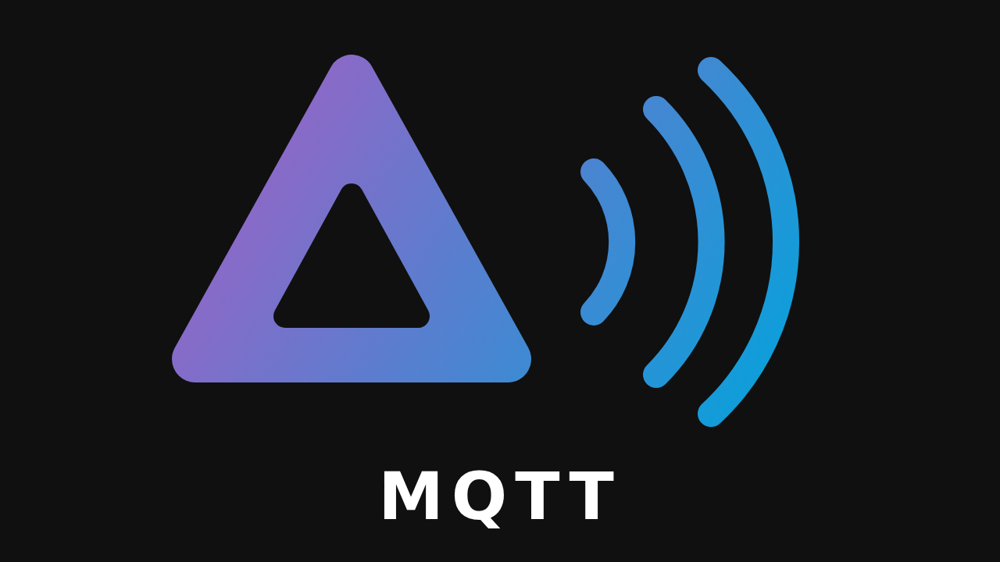

<p align="center"></p>

# Jellyfin MQTT Plugin

[](https://jellyfin.org)
[](https://mqtt.org)

Publishes Jellyfin clients as media players over MQTT, so home automation tools such as Home Assistant can follow and control them without polling.

- Each device of the selected users becomes a persistent player (keyed on its Jellyfin device id).
- State (`off`, `idle`, `playing`, `paused`), now playing metadata, artwork (as image bytes), volume and mute are pushed as soon as Jellyfin reports them.
- Play, pause, stop, next, previous, seek, volume and mute commands are forwarded to the client. Commands run as the server.

Requires Jellyfin 12.

## Installation

In Jellyfin, open **Dashboard → Plugins → Repositories**, add one of these repositories, then install **MQTT** from the catalog:

- Stable releases: `https://lmgarret.github.io/jellyfin-mqtt-plugin/manifest.json`
- Stable releases plus the latest `master` build: `https://lmgarret.github.io/jellyfin-mqtt-plugin/manifest-unstable.json`

## Configuration

In the plugin settings:

- **Broker**: host, port, TLS and credentials. The bridge stays idle until a host is set.
- **Topics**: base topic (default `jellyfin`), optionally a Jellyfin URL to also publish artwork as a link, and the artwork published for episodes (episode, season or series image).
- **Integrations**: the MQTT formats players are published in, see below, each with a link to its consumer's repository and its own settings. `mqtt_universal_media_player` is enabled by default; `mqtt_media_player` and `mqtt-mediaplayer` are also available.
- **Exposed players**: no user is exposed by default. Select users, then check the devices to publish; new devices stay hidden until checked. Each user's devices are listed in a sortable table with their client, when they were last seen and what they are playing; the header checkbox selects or clears every shown device.

## Architecture

The core tracks the exposed devices and their sessions, and builds a format-neutral player state (status, metadata, artwork, volume). It hands every change to the enabled **integrations**, and executes the neutral commands (play, pause, seek, volume, …) they receive.

Each integration owns its topics and payloads, so supporting another consumer means adding an `IPlayerIntegration` (see `Jellyfin.Plugin.Mqtt/Integrations/`) without touching the core. Its name, description, repository and settings are listed on the configuration page automatically. Several integrations can be enabled at once, as long as their topics do not overlap.

Shared by every integration:

| Topic | Direction | Payload |
| --- | --- | --- |
| `<base>/status` | out, retained | `online` / `offline` (last will) |

## Integration: `mqtt_universal_media_player`

Home Assistant's MQTT integration has no `media_player` discovery. Install the [MQTT Universal Media Player](https://github.com/grzegorz914/homeassistant-mqtt-media-player) custom integration (HACS custom repository, v0.3.0 or later); players then show up automatically. Its discovery prefix is configurable (default `homeassistant`).

| Topic | Direction | Payload |
| --- | --- | --- |
| `<base>/players/<id>/state` | out, retained | JSON state, see below |
| `<base>/players/<id>/image` | out, retained | Artwork bytes (JPEG/PNG, max 600px), empty when nothing plays |
| `<base>/players/<id>/command` | in | JSON command, see below |
| `<prefix>/media_player/jellyfin_<server>_<id>/config` | out, retained | Discovery |

`<id>` is a hash of the Jellyfin device id.

State:

```json
{
  "state": "playing",
  "volume": 80,
  "muted": false,
  "media_id": "…",
  "media_title": "Pilot",
  "media_artist": null,
  "media_album_name": null,
  "media_series_title": "Some Show",
  "media_season": 1,
  "media_episode": 1,
  "media_content_type": "episode",
  "media_image_url": "http://jellyfin.local:8096/Items/…/Images/Primary?tag=…",
  "media_duration": 2640,
  "app_name": "Jellyfin Android TV",
  "device_name": "Living room TV",
  "user": "alice",
  "media_position": 125
}
```

Every key is always present (`null` when not applicable). Position-only updates are sent at most every 10 seconds.

Commands, several keys may be combined:

| Key | Value |
| --- | --- |
| `play`, `pause`, `play_pause`, `stop`, `next`, `previous` | any |
| `seek` | position in seconds |
| `volume` | 0–100 |
| `mute` | `true` / `false` |

Example: `mosquitto_pub -t jellyfin/players/<id>/command -m '{"pause": true}'`

## Integration: `mqtt_media_player`

Install the [MQTT Media Player](https://github.com/bkbilly/mqtt_media_player) custom integration (HACS); players then show up automatically. It only listens under the `homeassistant` discovery prefix, so the prefix setting does not apply. Stop and seek are not supported by it.

Do not install both Home Assistant integrations: `mqtt_media_player` also picks up the announcements meant for `mqtt_universal_media_player`.

| Topic | Direction | Payload |
| --- | --- | --- |
| `<base>/mqtt_media_player/<id>/<field>` | out, retained | Plain value, empty when not applicable, see below |
| `<base>/mqtt_media_player/<id>/set/<command>` | in | See below |
| `homeassistant/media_player/jellyfin/jellyfin_<server>_<id>/config` | out, retained | Discovery |

Fields: `state` (`off`, `idle`, `playing`, `paused`), `title`, `artist` (the series for episodes), `album`, `duration` and `position` (seconds), `volume` (`0`–`1`), `mute` (`mute` / `unmute`), `mediatype`, and `albumart` (base64 image). Unchanged fields are not published again, except the position.

Commands: `play`, `pause`, `playpause`, `next`, `previous` (any payload), `volume` (`0`–`1`), `mute` (`mute` / `unmute`).

Example: `mosquitto_pub -t jellyfin/mqtt_media_player/<id>/set/volume -m 0.4`

Players no longer exposed are withdrawn, but the integration keeps their entity: delete it in Home Assistant.

## Integration: `mqtt-mediaplayer`

For the [hass-mqtt-mediaplayer](https://github.com/TroyFernandes/hass-mqtt-mediaplayer) custom integration (HACS). It has no discovery: its media players are declared in YAML, from templates over Home Assistant entities. So each player is discovered as a native MQTT sensor, named after the device, whose state is the playback status (`off`, `idle`, `playing`, `paused`) and whose attributes hold the metadata. Its discovery prefix is configurable (default `homeassistant`).

| Topic | Direction | Payload |
| --- | --- | --- |
| `<base>/mqtt_mediaplayer/<id>/state` | out, retained | JSON state: the keys of `mqtt_universal_media_player` without position and duration, plus `command_topic` and `albumart_topic` |
| `<base>/mqtt_mediaplayer/<id>/albumart` | out, retained | Base64 artwork, empty when nothing plays |
| `<base>/mqtt_mediaplayer/<id>/command` | in | JSON command, as for `mqtt_universal_media_player` |
| `<prefix>/sensor/jellyfin_<server>_<id>/config` | out, retained | Discovery |

`media_artist` falls back to the series for episodes. Declare each player in `configuration.yaml`, replacing `sensor.living_room_tv` with its sensor, and the `album_art` topic with the sensor's `albumart_topic` attribute:

```yaml
media_player:
  - platform: mqtt-mediaplayer
    name: "Living room TV"
    topic:
      song_title: "{{ state_attr('sensor.living_room_tv', 'media_title') }}"
      song_artist: "{{ state_attr('sensor.living_room_tv', 'media_artist') }}"
      song_album: "{{ state_attr('sensor.living_room_tv', 'media_album_name') }}"
      song_volume: "{{ state_attr('sensor.living_room_tv', 'volume') }}"
      player_status: "{{ states('sensor.living_room_tv') }}"
      album_art: "jellyfin/mqtt_mediaplayer/<id>/albumart"
      volume:
        service: mqtt.publish
        data:
          topic: "{{ state_attr('sensor.living_room_tv', 'command_topic') }}"
          # Volume set sends 0-1, volume up/down send 0-100.
          payload: '{"volume": {{ (volume * 100) | round | int if volume is float else volume }}}'
    play:
      service: mqtt.publish
      data:
        topic: "{{ state_attr('sensor.living_room_tv', 'command_topic') }}"
        payload: '{"play": true}'
    pause:
      service: mqtt.publish
      data:
        topic: "{{ state_attr('sensor.living_room_tv', 'command_topic') }}"
        payload: '{"pause": true}'
    next:
      service: mqtt.publish
      data:
        topic: "{{ state_attr('sensor.living_room_tv', 'command_topic') }}"
        payload: '{"next": true}'
    previous:
      service: mqtt.publish
      data:
        topic: "{{ state_attr('sensor.living_room_tv', 'command_topic') }}"
        payload: '{"previous": true}'
```

## Building

```sh
dotnet build Jellyfin.Plugin.Mqtt.slnx
```

Copy `Jellyfin.Plugin.Mqtt.dll` and `MQTTnet.dll` from `Jellyfin.Plugin.Mqtt/bin/Debug/net10.0/` into a `Mqtt` folder in the Jellyfin `plugins` directory.

## Releasing

CI (`.github/workflows/ci.yml`) runs tests, `dotnet format`, CodeQL and a `jprm` package build on every pull request and on `master`. Each `master` build is also published as the rolling `edge` prerelease.

To cut a release, push a `vX.Y.Z` tag or run the **Release** workflow. If you run the workflow with no version, the next version is derived from the commits. Either way the workflow builds the plugin, writes the changelog, creates the GitHub release and regenerates the plugin repository on GitHub Pages (`pages.yml`).

Use [Conventional Commits](https://www.conventionalcommits.org/) (`feat:`, `fix:`, …) so version bumps and changelogs come out right.
